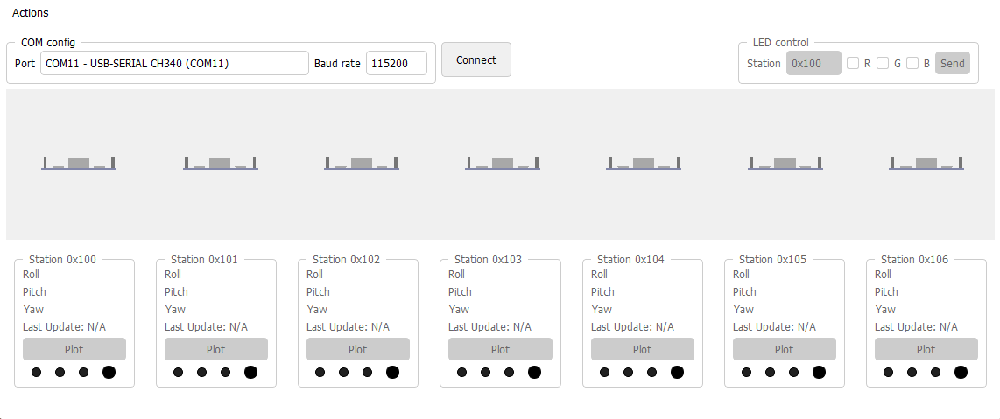
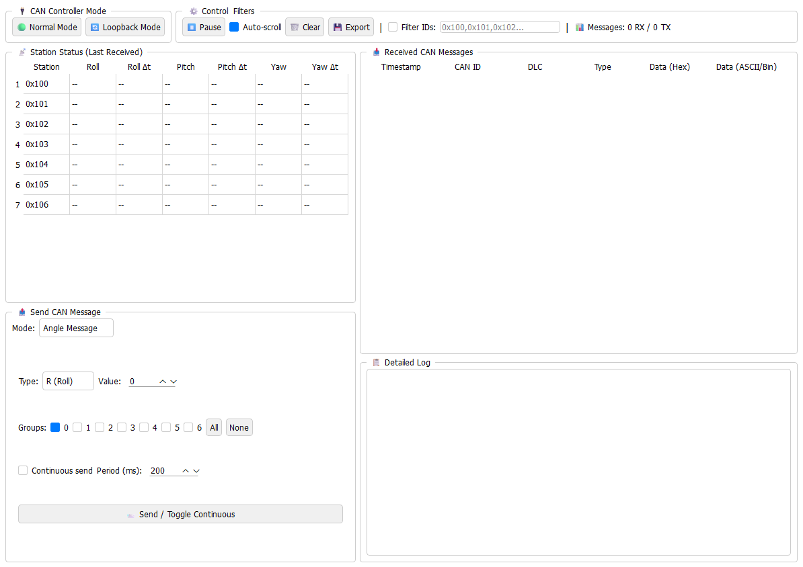

# Embeddster: Plataforma de Pruebas para Sistemas Embebidos

- [Embeddster: Plataforma de Pruebas para Sistemas Embebidos](#embeddster-plataforma-de-pruebas-para-sistemas-embebidos)
  - [Descripción General](#descripción-general)
    - [¿Qué Hace Embeddster?](#qué-hace-embeddster)
  - [Características Principales](#características-principales)
    - [Hardware](#hardware)
    - [Firmware (ESP32)](#firmware-esp32)
    - [GUI (Python)](#gui-python)
  - [Uso sin GUI (Solo PCB + Terminal Serial)](#uso-sin-gui-solo-pcb--terminal-serial)
    - [Comandos Disponibles](#comandos-disponibles)
    - [Mensajes Recibidos (Formato Serial)](#mensajes-recibidos-formato-serial)
    - [Indicadores LED](#indicadores-led)
    - [Ejemplos de Uso](#ejemplos-de-uso)
      - [1. Monitorear tráfico CAN](#1-monitorear-tráfico-can)
      - [2. Generar tráfico CAN aleatorio](#2-generar-tráfico-can-aleatorio)
      - [3. Enviar mensaje CAN personalizado](#3-enviar-mensaje-can-personalizado)
      - [4. Controlar LED RGB de estación remota](#4-controlar-led-rgb-de-estación-remota)
      - [5. Cambiar modo CAN a Loopback (para pruebas sin bus)](#5-cambiar-modo-can-a-loopback-para-pruebas-sin-bus)
      - [6. Volver a modo Normal](#6-volver-a-modo-normal)
    - [Notas Importantes](#notas-importantes)
  - [Uso con GUI (Python)](#uso-con-gui-python)
    - [Instalación y Configuración](#instalación-y-configuración)
    - [Modo Normal](#modo-normal)
    - [God Mode (Modo Avanzado)](#god-mode-modo-avanzado)
  - [Estructura del Proyecto](#estructura-del-proyecto)
  - [Protocolo de Comunicación](#protocolo-de-comunicación)
    - [Mensajes CAN (Formato)](#mensajes-can-formato)
      - [Ángulos (Angle Messages)](#ángulos-angle-messages)
      - [LEDs (LED Commands)](#leds-led-commands)
    - [Comandos Serial (ESP32 ↔ PC)](#comandos-serial-esp32--pc)
  - [Licencia](#licencia)
  - [Agradecimientos](#agradecimientos)


## Descripción General

**Embeddster** es una herramienta de desarrollo y pruebas para el curso **25.27 - Sistemas Embebidos** del ITBA (Instituto Tecnológico de Buenos Aires). Combina hardware (PCB con ESP32) y software (GUI en Python) para facilitar el desarrollo, depuración y evaluación de trabajos prácticos que involucran comunicación CAN, control de periféricos y protocolos embebidos.

### ¿Qué Hace Embeddster?
- **Hardware**: PCB personalizada que conecta un ESP32 a los periféricos de los TPs (encoder, displays 7-segmentos, LEDs, bus CAN).
- **Firmware**: Gestiona la comunicación serie con PC, controla LEDs de estado, maneja mensajes CAN (sniffer/envío) y soporta reintentos automáticos en caso de errores de bus.
- **GUI**: Aplicación Python con visualización 3D de estaciones, monitoreo de mensajes CAN, control de LEDs RGB y modo avanzado "God Mode" para debugging.
  
---

## Características Principales

### Hardware
- **PCB Embeddster** (diseño en `hw/kicad/`):
  - Conecta ESP32 a encoder rotativo, displays 7-segmentos (via shift registers 74HC595), LED RGB (WS2812B), transceiver CAN (MCP2515), LEDs de estado.
  - Compatible con placa TP1 del curso (displays, encoder, LEDs de estado).

### Firmware (ESP32)
- **Ubicación**: `fw/` (proyecto PlatformIO).
- **Funcionalidades**:
  - **Modos de operación**: Sniffer CAN (M1) y Random Send (M2), cambiables por comandos seriales.
  - **Protocolo serial**: Comandos para cambiar modos CAN (NORMAL/LOOPBACK), enviar mensajes CAN personalizados y controlar LEDs RGB.
  - **Reintentos automáticos**: Si falla el envío de un mensaje CAN (por error de bus), entra en "Retry Mode" (LED amarillo encendido) e intenta reenviarlo cada 2 segundos.
  - **Indicadores visuales**: LEDs de colores para estado del sistema (azul=sniffer, verde=random send, amarillo=retry, blanco=loopback).

### GUI (Python)
- **Ubicación**: `gui/` (PyQt6, OpenGL, Matplotlib).
- **Funcionalidades**:
  - **Visualización 3D**: Modelos de estaciones con orientación en tiempo real (roll/pitch/yaw).
  - **Control de LEDs**: Envío de comandos RGB a estaciones específicas.
  - **God Mode**: Ventana avanzada para monitoreo CAN, inyección de mensajes, filtros por ID, logs y export.
  - **Soporte TP2**: Extensión de [TiltNetworkTool](https://github.com/alheir/TiltNetworkTool), basado en [canmon](https://github.com/alheir/canmon).

## Uso sin GUI (Solo PCB + Terminal Serial)

En este modo, el ESP32 funciona de manera autónoma. Conecta un terminal serial a 115200 baud, 8N1. El ESP32 **inicia automáticamente en modo Sniffer (LED azul)**.

### Comandos Disponibles

| Comando | Descripción | Ejemplo |
|---------|-------------|---------|
| `M1` | Cambiar a **Sniffer Mode** (azul). Escucha mensajes CAN y los reenvía por serial. | `M1\n` |
| `M2` | Cambiar a **Random Send Mode** (verde). Genera y envía mensajes CAN aleatorios (ángulos simulados). | `M2\n` |
| `MODE_NORMAL` | Configurar controlador CAN en modo **Normal** (comunicación estándar). LED blanco OFF. | `MODE_NORMAL\n` |
| `MODE_LOOPBACK` | Configurar controlador CAN en modo **Loopback** (pruebas sin bus externo). LED blanco ON. | `MODE_LOOPBACK\n` |
| `SEND_{id}_{b1}_{b2}_...` | Enviar mensaje CAN personalizado. `{id}` en hex, `{b1}...` bytes en hex. | `SEND_100_52_2D_31_30\n` |
| `LED_{station}_{r}_{g}_{b}` | Controlar LED RGB de una estación. `{r/g/b}` = 0 o 1. | `LED_0_1_0_0\n` (estación 0, rojo ON) |

### Mensajes Recibidos (Formato Serial)

**En Modo Sniffer (M1)**:
```
RXED: ID=0x100 Data=0x522D3130='R-10' Len=4
RXED: ID=0x101 Data=0x432B3532='C+52' Len=4
```

**En Modo Random Send (M2)**:
```
SENT ANGLE: ID=0x100 Data=0x522D3134='R-14' Len=5
SENT ANGLE: ID=0x100 Data=0x432B3837='C+87' Len=5
```

**En Retry Mode** (si falla envío):
```
Error sending CAN msg: R-10

~~~~ ENTERING RETRY MODE ~~~~
Failed message: ID=0x100 Data='R-10'
RETRY: Attempting to resend ID=0x100 Data='R-10'
RETRY: Failed, will retry again...
```

### Indicadores LED

| LED | Color | Significado |
|-----|-------|-------------|
| D5 | Azul | Modo Sniffer activo |
| D6 | Verde | Modo Random Send activo |
| D4 | Amarillo | Retry Mode (reintentando envío fallido) |
| D3 | Blanco | Modo Loopback del controlador CAN activo |

### Ejemplos de Uso

#### 1. Monitorear tráfico CAN
```bash
# El ESP32 ya inicia en sniffer, pero si cambias de modo, vuelve con:
M1

# Verás mensajes como:
# RXED: ID=0x100 Data=0x522D3130='R-10' Len=4
```

#### 2. Generar tráfico CAN aleatorio
```bash
M2

# El ESP32 enviará mensajes aleatorios con diferentes formatos:
# SENT ANGLE: ID=0x100 Data=0x522D3134='R-14' Len=4    # Formato simple
# SENT ANGLE: ID=0x101 Data=0x432B3435='C+45' Len=4    # Con signo explícito
# SENT ANGLE: ID=0x102 Data=0x4F3030='O00' Len=3       # Zero-padded 2 dígitos
# SENT ANGLE: ID=0x100 Data=0x522D303732='R-072' Len=5 # Zero-padded 3 dígitos
# SENT ANGLE: ID=0x101 Data=0x432B313037='C+107' Len=6 # Signo + padding
```

**Características del Random Send**:
- Simula **4 estaciones** (IDs 0x100-0x103) con tráfico aleatorio.
- Genera mensajes en **6 formatos diferentes** para probar robustez del parser:
  - Simple: `'R-34'`, `'C0'`, `'O67'` (sin signo para positivos, sin padding)
  - Signo explícito: `'R+138'`, `'C+5'` (siempre muestra +/-)
  - Zero-padded 2 dígitos: `'R00'`, `'C-07'`
  - Zero-padded 3 dígitos: `'O000'`, `'C-072'`
  - Signo + padding: `'R+107'`, `'C+045'`
  - Mixto (aleatorio entre formatos)
- Intervalos aleatorios entre **100ms y 2 segundos** entre mensajes.
- Valores varían en hasta ±30° del anterior, limitados a -179° a 180°.

#### 3. Enviar mensaje CAN personalizado
```bash
# Enviar a ID 0x105: bytes 0x41 0x42 0x43 ('ABC')
SEND_105_41_42_43

# Respuesta:
# Custom CAN message sent
```

#### 4. Controlar LED RGB de estación remota
```bash
# Estación 1, LED verde encendido (r=0, g=1, b=0)
LED_1_0_1_0

# Si es estación propia (GROUP_NUMBER=0):
# Own LED updated
# Si es remota:
# LED command sent via CAN
```

#### 5. Cambiar modo CAN a Loopback (para pruebas sin bus)
```bash
MODE_LOOPBACK

# Respuesta:
# CAN mode set to LOOPBACK
# LED blanco se enciende
```

#### 6. Volver a modo Normal
```bash
MODE_NORMAL

# Respuesta:
# CAN mode set to NORMAL
# LED blanco se apaga
```

### Notas Importantes
- **Retry Mode**: Si el bus CAN está desconectado o hay errores, el ESP32 entra en modo retry (LED amarillo). Intentará reenviar el mensaje fallido cada 2 segundos hasta que tenga éxito o cambies de modo.
- **Comandos ignorados**: Si envías `M1` estando ya en sniffer, no hace nada. Lo mismo para `M2` en random send.
- **Formato de datos**: Los mensajes CAN usan formato ASCII para ángulos (e.g., `R-10` = Roll -10 grados). LEDs usan formato binario empaquetado (ver código en `main.cpp`).

---

## Uso con GUI (Python)

La GUI proporciona una interfaz visual para interactuar con las estaciones CAN, monitorear mensajes en tiempo real y controlar LEDs.

### Instalación y Configuración

1. **Crear entorno virtual** (en el directorio del proyecto):
   ```bash
   python -m venv .venv
   ```

2. **Activar el entorno virtual**:
   - Windows:
     ```bash
     .venv\Scripts\activate
     ```
   - Linux/Mac:
     ```bash
     source .venv/bin/activate
     ```

3. **Instalar dependencias**:
   ```bash
   pip install -r gui/requirements.txt
   ```

4. **Ejecutar la aplicación**:
   ```bash
   python gui/main.py
   ```

### Modo Normal



**Características**:
- **Visualización 3D**: Modelos de estaciones (FRDM-K64F o avión) con orientación en tiempo real basada en mensajes CAN (Roll/Pitch/Yaw).
- **Panel de estaciones**: Muestra últimos valores de ángulos, tiempo desde última actualización y botón para gráficos históricos.
- **Control de LEDs**: Selecciona estación y colores RGB para enviar comandos LED via CAN.
- **Emulador**: Modo simulación sin hardware real (opción "Serial Data Emulator" en selector de puertos).

**Cómo usar**:
1. Conecta el ESP32 por USB.
2. Selecciona el puerto COM en la GUI y haz clic en "Connect".
3. Los mensajes CAN se procesarán automáticamente (via [`ProtocolHandler`](gui/src/protocol/protocol_handler.py)).
4. Para enviar LED: Selecciona estación, marca colores (R/G/B) y haz clic en "Send LED Command".

### God Mode (Modo Avanzado)



**Acceso**: Menú "Actions" → "God Mode" (requiere conexión real, no emulador).

**Características**:
- **Control de modos CAN**: Cambiar entre Normal y Loopback directamente desde la interfaz.
- **Monitoreo CAN**: Tabla con timestamp, ID, DLC, tipo (Angle/LED/Unknown), datos en hex y ASCII/binario.
- **Inyección de mensajes**:
  - **Manual**: Enviar mensajes CAN con ID y datos personalizados (hex o ASCII).
  - **Angle Message**: Enviar ángulos a múltiples grupos simultáneamente (selección con checkboxes).
  - **LED Command**: Controlar LEDs RGB de estaciones remotas.
  - **Random Traffic**: Generar tráfico CAN aleatorio con modos configurables por grupo (Sine/Const/Noise).
- **Filtros**: Filtrar mensajes por IDs específicos.
- **Logs detallados**: Panel inferior con historial de mensajes (exportable a TXT).
- **Tabla de estaciones**: Estado de última recepción de Roll/Pitch/Yaw con timestamps.

**Comportamiento especial**:
- Al abrir God Mode, el ESP32 se pone automáticamente en **modo Sniffer (M1)**.
- Al cerrar God Mode o la aplicación, el ESP32 se resetea a **modo Normal y Sniffer**.

**Ejemplo de uso**:
1. Abre God Mode desde el menú.
2. Para inyectar mensaje: Selecciona "Angle Message", elige grupos (checkboxes), tipo (R/C/O), valor y haz clic en "Send".
3. Para modo Loopback: Haz clic en "🔄 Loopback Mode". El LED blanco en la placa se encenderá.
4. Para filtrar: Marca "Filter IDs", ingresa IDs separados por coma (e.g., `0x100,0x101`).

---

## Estructura del Proyecto

```
embeddster/
├── fw/                    # Firmware ESP32 (PlatformIO)
│   ├── src/main.cpp       # Lógica principal (sniffer, random send, retry)
│   ├── include/           # Headers (pin_assignment, tp1board, sr595)
│   └── platformio.ini     # Configuración de compilación
├── gui/                   # GUI Python (PyQt6)
│   ├── main.py            # Punto de entrada
│   ├── src/
│   │   ├── mainwindow.py  # Ventana principal
│   │   ├── protocol/      # ProtocolHandler para parseo de mensajes
│   │   └── widgets/       # God Mode, plots, visualizador 3D
│   └── requirements.txt   # Dependencias Python
├── hw/                    # Diseño PCB (KiCad)
│   └── kicad/             # Esquemáticos y layout
├── docs/                  # Imágenes para README
└── README.md              # Este archivo
```

---

## Protocolo de Comunicación

### Mensajes CAN (Formato)

#### Ángulos (Angle Messages)
- **ID**: `0x100 + {station_number}` (e.g., estación 0 = 0x100, estación 1 = 0x101).
- **Datos**: ASCII `{tipo}{valor}` en formato variable (1-6 bytes):
  - `{tipo}`: `'R'` (Roll), `'C'` (Pitch/Cabeceo), `'O'` (Yaw/Orientación)
  - `{valor}`: Ángulo entre -179° y 180° en diferentes formatos válidos:
    - **Simple**: `'R-10'`, `'C0'`, `'O67'` (sin signo para positivos)
    - **Signo explícito**: `'R+138'`, `'C+5'` (con + o -)
    - **Zero-padded**: `'R00'`, `'C-072'`, `'O000'` (2 o 3 dígitos)
    - **Combinado**: `'R+107'`, `'C+045'` (signo + padding)
  - **Ejemplos válidos**: `'R-34'`, `'C0'`, `'O67'`, `'R+138'`, `'R00'`, `'C-072'`, `'R+107'`, `'O000'`
  - Longitud variable (DLC 2-5 bytes típicamente).

#### LEDs (LED Commands)
- **ID**: Mismo que ángulos (`0x100 + station`).
- **Datos**: 1 byte en formato `1JKL 0RGB`:
  - Bit 7: Siempre 1 (identificador LED).
  - Bits 6-4 (JKL): Número de estación destino.
  - Bits 2-0 (RGB): Estados de colores (1=encendido, 0=apagado).

### Comandos Serial (ESP32 ↔ PC)

Ver tabla en sección "Uso sin GUI" para lista completa.

## Licencia

Licencia MIT (ver [`LICENSE`](LICENSE)).

---

## Agradecimientos

- **Cátedra de Sistemas Embebidos (ITBA)**: Daniel Andrés Jacoby, Nicolás Magliola y Matías Bergerman por las especificaciones de TPs y soporte.
- **Proyectos relacionados**: [TiltNetworkTool](https://github.com/alheir/TiltNetworkTool) (base GUI, diseñado originalmente por el Ing. Juan Francisco Sbruzzi) y [canmon](https://github.com/alheir/canmon).
